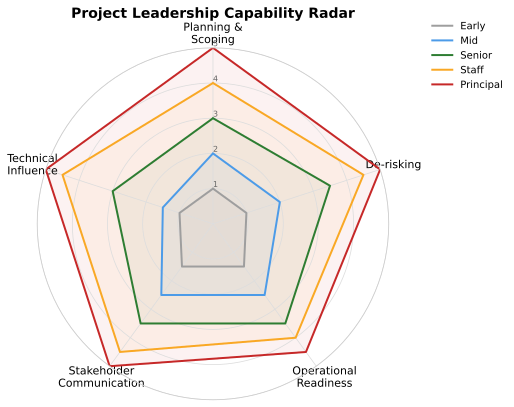

# Project Leadership Capability Radar

> Part of [Workbench by Runtime Leadership](https://github.com/runtime-leadership/workbench), a lightweight workspace for navigating engineering work, people, and decisions. Use this resource on its own or in a private Workbench created from the GitHub template.

Leading a project does not require an official lead title. Anyone on a project can demonstrate leadership: driving a decision, unblocking a teammate, sending a clear update, or preparing a plan others can contribute to. This resource gives engineers and managers shared language for that: four dimensions of project leadership, and how independently and broadly someone typically demonstrates each one as they grow.

It is a reference for calibration and conversation, not a scoring rubric. Use it to compare interpretations, not to calculate a level.

## The Scale

Every dimension uses the same five-point scale, so a given number means the same thing no matter which axis you are looking at. The scale describes how independently and how broadly someone demonstrates the behavior, not whether they are allowed to do it at all, anyone can demonstrate any of these situationally, regardless of title.

1. **Observing** — Not yet expected to do this independently; learns primarily by watching others do it.
2. **Supported** — Can do this with guidance or review, on familiar, well-scoped work.
3. **Independent** — Does this without oversight, on work of normal scope.
4. **Extending** — Does this independently on ambiguous, complex, or cross-team work, and is a reference point for peers.
5. **Setting the standard** — Shapes how the broader team or organization approaches this; others calibrate against their example.

## The Radar

The shape matters as much as the size. Growth is not identical across every dimension. Technical Influence stays at Observing through both Early and Mid, then jumps straight to Independent at Senior, deliberately skipping Supported. That jump is the point: moving from executing well against someone else's plan to being the one who shapes the plan is a distinct, often later, transition, not a steady climb like the other three dimensions.

## The Four Dimensions

### Planning & Scoping

Turning ambiguous work into a plan other people can actually pick up and contribute to.

| Level | Score | What this typically looks like |
| --- | --- | --- |
| Early | 1 — Observing | Can break a well-defined task into an ordered checklist; needs help identifying what's missing. |
| Mid | 2 — Supported | Can scope a small, well-bounded project into a plan with milestones; still benefits from review before committing to sequencing. |
| Senior | 3 — Independent | Independently scopes ambiguous, multi-week work into a plan that other engineers can pick up pieces of and execute against. |
| Staff | 4 — Extending | Plans work that spans multiple engineers or teams, sequencing it so dependencies don't block each other; the plan itself becomes a reference other leads calibrate against. |
| Principal | 5 — Setting the standard | Scopes and sequences initiatives at the level of a roadmap, translating ambiguous strategic goals into a structure multiple teams can plan around. |

### De-risking & Delivery

Anticipating what could go wrong, resolving blockers when they surface, whether the blocker is yours or someone else's, and making sure the work actually ships safely.

| Level | Score | What this typically looks like |
| --- | --- | --- |
| Early | 1 — Observing | Asks questions when something about their own task is unclear; follows an existing rollout or rollback runbook when told to. |
| Mid | 2 — Supported | Identifies the riskiest unknown in their own piece of work and raises it early rather than discovering it mid-implementation; writes a basic rollout plan for their own change, including a rollback path, with review. |
| Senior | 3 — Independent | Proactively maps dependencies and runs small prototypes or spikes to validate risky assumptions before committing the team to an approach; steps in to unblock a stuck teammate or a stalled decision without being asked; designs load testing, rollout, and rollback strategy without prompting. |
| Staff | 4 — Extending | Operates at the scale of a multi-team initiative: identifies which unknowns would be catastrophic if wrong and sequences the plan so those get tested first; resolves cross-team blockers that no single team can clear alone; sets the operational bar for what "ready to launch" means for their team. |
| Principal | 5 — Setting the standard | Shapes how the organization approaches risk and delivery generally, for example what validation an initiative needs before it is greenlit, or how the organization thinks about blast radius and staged rollout for high-risk changes. |

### Stakeholder Communication

Keeping the right people informed, at the right altitude, without being asked.

| Level | Score | What this typically looks like |
| --- | --- | --- |
| Early | 1 — Observing | Reports status accurately when asked. |
| Mid | 2 — Supported | Proactively shares status and flags blockers on their own work without being asked. |
| Senior | 3 — Independent | Communicates project status, risk, and trade-offs to both engineering and non-engineering stakeholders, adjusting the message for the audience. |
| Staff | 4 — Extending | Manages expectations across multiple stakeholders with competing priorities, and escalates early and clearly when something needs a decision above their level. |
| Principal | 5 — Setting the standard | Represents the initiative to senior leadership and cross-functional partners, translating technical trade-offs into terms that inform business decisions. |

### Technical Influence

Finding a better way, being willing to challenge assumptions, bringing an opinion to the table, staying open to other input, and driving disagreement to a real decision rather than a stalemate. Delivering the outcome still matters here, this is not about delegating the work and the decision-making away; it is about bringing others along while remaining accountable for what ships.

| Level | Score | What this typically looks like |
| --- | --- | --- |
| Early | 1 — Observing | Executes against plans and designs others have put together; asks clarifying questions but generally defers on direction. |
| Mid | 1 — Observing | Begins forming opinions on the work directly in front of them and may raise a concern when something looks wrong, but still largely operates within a plan set by others rather than shaping it. |
| Senior | 3 — Independent | Proactively identifies better approaches and pushes back on assumptions within their own project; brings a point of view to design discussions rather than only reacting to them. |
| Staff | 4 — Extending | Actively shapes direction across a project or initiative, challenges assumptions before they become sunk cost, and is looked to for an opinion, not just an implementation. |
| Principal | 5 — Setting the standard | Sets direction that other senior engineers organize around, and drives consensus across disagreeing stakeholders on high-ambiguity problems, while remaining accountable for outcomes rather than only advising from the sideline. |

Mid stays at Observing here on purpose, the jump to Independent at Senior is deliberately the steepest transition on the chart.

## How to Use This

Walk through the four dimensions together and mark where each of you sees the engineer currently landing on each one. A real profile will rarely land on a single tidy score across every axis, and the gaps between dimensions are often the most useful part of the conversation.

Use the behavioral language in the tables above as calibration language, not a checklist. The goal is to find shared examples, not to complete every cell.

Prioritize the one or two dimensions where closing the gap actually matters for the next opportunity in front of the engineer, not every dimension at once.

## Keep the Limits Clear

- This describes typical project-leadership expectations, not a complete engineering competency ladder; pair it with your employer's own framework for the broader picture.
- The scale exists to make the chart legible and to give calibration language, not to score a person. Two people at the same level can have very different shapes and both be right on track.
- None of this requires an official lead title. Someone can demonstrate Independent or even Extending behavior on a single dimension for a single project without that being their formal role.
- A gap on this radar is a conversation starter, not a verdict. It should support judgment and dialogue, the same way the rest of Workbench is meant to.
